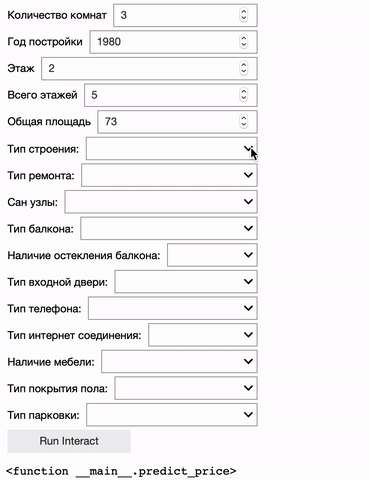

# Apartment price prediction

> Warning: the parser might be outdated. Last time it has been checked in January 2019. More likely, you might need to slightly modify it.

The repository consists of:
1. [`Parser`](parser.py) as data source supplier. The parsed resource is [krisha.kz](https://krisha.kz) as the most popular website about selling apartments in Kazakhstan.
2. Multiple notebooks ([EDA](https://en.wikipedia.org/wiki/Exploratory_data_analysis), regressions and apartment price prediction itself)

## Price prediction example (.gif)

## Parsed data
### Data summary

### Data types

## Geographical location of the parsed data
### Map with markers

### Heat map

## Data visualization
### Pearson correlation

### Price range

### Area to price dependency

### Linear regression
